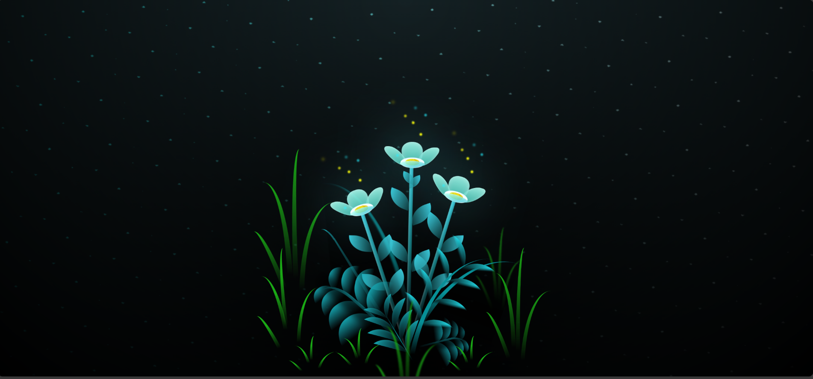

# 🌸 Glowing Plants Animation

A visually immersive **night-themed glowing plants animation** created using **pure HTML, CSS, and JavaScript**.  
This project focuses on advanced CSS animations, glowing effects, and smooth motion to create a magical garden-like experience.

---

## ✨ Preview

---

## 🚀 Live Demo

🔗 **Live Demo:** https://anshu-dha.github.io/glowing-plants-animation/

---

## 🛠️ Built With

- **HTML5** – Structured markup  
- **CSS3** – Advanced animations, gradients & glow effects  
- **JavaScript** – Animation triggers and interactions  

---

## 🌿 Features

- 🌙 Night-themed glowing background  
- 🌸 Animated flowers with smooth blooming effects  
- ✨ Floating glowing particles  
- 🌱 Detailed grass and leaf animations  
- 🎨 Pure CSS creativity (no libraries used)  
- 💻 Fully responsive & lightweight  

---

## 🎯 Learning Highlights

- Deep understanding of **CSS keyframe animations**
- Mastery of **transform, perspective & layering**
- Creative use of **gradients, blur & glow effects**
- Clean and structured **HTML for complex visual layouts**

---

## 🤍 Inspiration

This project is inspired by **nature, calm aesthetics, and creative frontend animation experiments**, focusing on building visually pleasing and immersive user experiences using pure CSS.

## 👩‍💻 Author

**Anshu**  
Frontend Developer | Creative UI Enthusiast  

---

⭐ If you like this project, feel free to star the repository!
